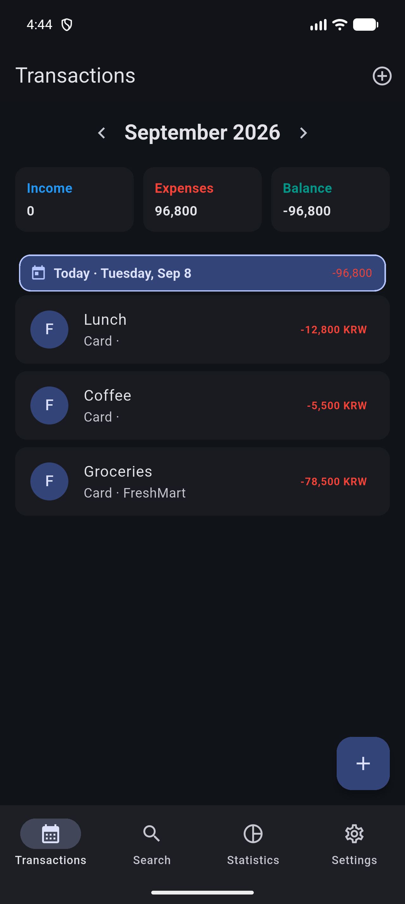
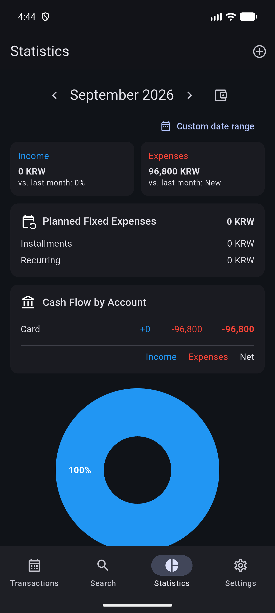

# Busy Budget

Busy Budget is a privacy-friendly personal finance app built with Flutter. It helps you record income and expenses, understand monthly spending, manage recurring payments and installments, and keep portable spreadsheet backups—without reading SMS messages or sending financial data to a server.

## Screenshots

  
  &nbsp;&nbsp;
  

## Highlights

- Browse monthly income, expenses, daily totals, and the current balance.
- Add, edit, duplicate, search, and safely delete transactions.
- Record regular purchases, installments, and monthly recurring payments.
- Review category breakdowns, account cash flow, fixed expenses, and yearly trends.
- Set a total monthly budget and optional category budgets.
- Manage custom accounts and separate income and expense categories.
- Export a complete XLSX backup and restore it with validation and transactional replacement.
- Import legacy XLSX files exported by the Korean *My Budget Book* app.
- Choose system, light, or dark appearance.
- Keep everything local in SQLite. The app does not request SMS access or auto-create transactions from messages.

## Built With

- Flutter and Material 3
- SQLite via sqflite / sqflite_common_ffi
- fl_chart for spending and trend charts
- excel and file_picker for portable XLSX backup and restore
- intl for dates and currency formatting

The repository includes Android and Windows targets.

## Getting Started

### Requirements

- Flutter SDK 3.13 or later
- An Android emulator/device or a Windows development environment

### Run the app

    flutter pub get
    flutter run

To choose a connected device explicitly:

    flutter devices
    flutter run -d <device-id>

### Build an Android APK

    flutter build apk --release

The generated APK is written to build/app/outputs/flutter-apk/app-release.apk.

## Data and Backup Safety

Busy Budget parses and validates an XLSX restore file before changing local data. Once validation succeeds, the current ledger is replaced inside a single SQLite transaction. If validation or insertion fails, the existing data remains intact.

When importing a legacy workbook, transactions with an empty title use their category name as a fallback so they are not silently omitted.

## Project Structure

    lib/
    |-- data/       SQLite database and migrations
    |-- models/     Transactions, recurring plans, budgets, and backups
    |-- services/   XLSX import and export
    |-- utils/      Currency formatting helpers
    |-- main.dart   Application UI and navigation
